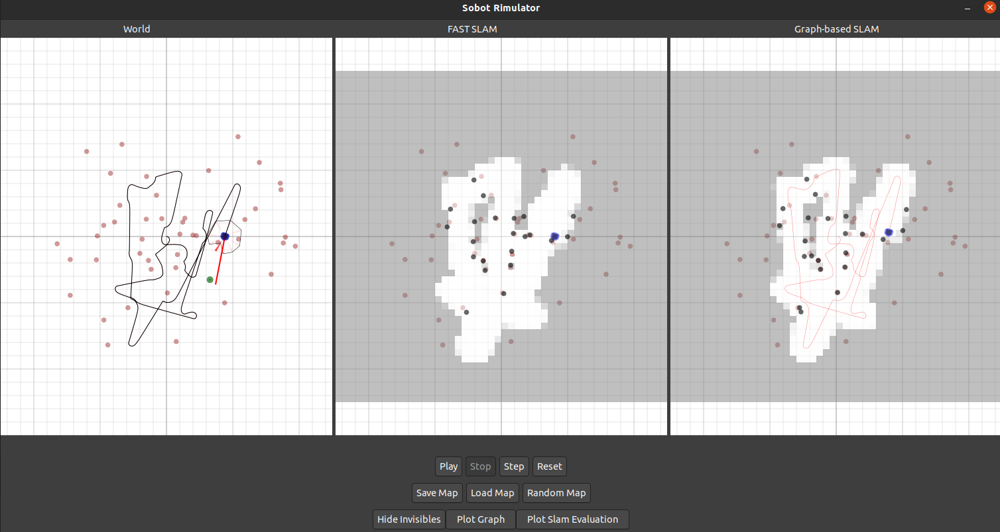

# Sobot Rimulator - A Robot Programming Tool

This project is an extension of the [sobot rimulator](https://github.com/nmccrea/sobot-rimulator) developed by Nick McCrea
which allows the simulation of a mobile robot in a map of obstacles that must be avoided.
The [extension](https://collaborating.tuhh.de/cva9931/sobot-rimulator) developed by Michael Dobler includes 
the integration of the EKFSLAM and FastSLAM algorithms to perform an estimation 
of the current robot state and its surrounding environment based on its previous motion commands 
and proximity sensor readings. In my extension Graph-based SLAM algorithm was integrated 
to perform an estimation of the full traverse trajectory of the robot as well as the surrounding environment based on its 
previous motion commands and the measurements from the sensors and the wheel encoders. Occupancy grid mapping algorithm 
and A* path planning algorithm were also integrated to search a path from the robot to the goal based on the mapping of the area where the robot has visited. 

## Setup

It is recommended to run the simulator directly on your native machine. For this, the following must be installed
- Python 3: Please follow the instructions at http://www.python.org/download/
- PyGTK 3: Please follow the instructions at https://pygobject.readthedocs.io/en/latest/getting_started.html

An additional dependency (see [scikit-sparse](https://scikit-sparse.readthedocs.io/en/latest/overview.html)) is required:

    sudo apt-get install libsuitesparse-dev

Additional dependencies can then be installed using `pip`

    pip3 install matplotlib numpy scipy pandas
    pip3 install pyyaml
    
The simulator is then started by 

    python rimulator.py
    
which uses the default `config.yaml` configuration file. A specific configuration file can be
specified as an additional program parameter:

    python rimulator.py original_config.yaml
    python rimulator.py config_ekf_fastslam.yaml

Alternatively, the simulator can be run using `docker`, as described in [documentation/docker.md](documentation/docker.md).
    

## Graphical User Interface

The graphical user interface consists of the visualization of the current simulated world as well as a control panel of 
buttons with which the user can interact. The robot is depicted in blue and aims to reach its goal depicted in green 
while avoiding collisions with the red objects. The buttons of the control panel are:

#### Control row

- **Play**: Starts or continues the simulation
- **Stop**: Stops the simulation
- **Step**: Progresses the simulation by a single simulation cycle. If the simulation is running, it will first be stopped.
- **Reset** Reset the robot to its initial position 

#### Map row

- **Save map**: Opens a directory window, in which filename and path can be specified in order to save the current map.
 The default directory is [/maps](/maps), where multiple example maps are already stored.
- **Load map**: Opens a directory window, where a saved map can be selected to be loaded into the simulator.
- **Random map**: Generates a random map and resets the robot to the initial origin pose. Map generation parameters are 
specified in the configuration file.

#### Additional information row

- **Show/Hide invisibles**: The button lets the user toggle whether additional information shall be visualized. These 
include 
    - The true trajectory of the robot
    - The poximity sensors, where those detecting an obstacles are highlighted
    - The vector that the robot is currently headed towards
    - Additionally, the color of this vector displays the current control state of the robot
        - A green vector represents the `go to goal` state
        - An orange vector represents the `follow wall` state
        - A red vector represents the `avoid obstacles` state
    - The true obstacle positions for the SLAM frames
- **Plot covariance matrix**: This plots a visualization of the current covariance matrix of the EKF SLAM algorithm. 
Only displayed if the EKF SLAM is enabled in the configuration.
- **Plot Slam Evaluation**: Plots a graph for every enabled SLAM algorithm displaying the accuracy of its estimations 
over the course of the simulation. Only displayed if the SLAM evaluation is enabled in the configuration.
- **Plot Graph**: Plots a graph estimated by Graph-based SLAM algorithm displaying the pose-vertices 
representing the robot poses and landmark-vertices representing the landmark positions.
## Configuration

The simulator can be configured by a variety of parameters. The default configuration file is [config.yaml](config.yaml)
where all parameters are documented. This file includes the EKF Slam, FastSlam, Graph based Slam, Occupancy gird mapping and A* path planning that can be enabled or
disabled. The configuration file [config_ekf_fastslam.yaml](config_ekf_fastslam.yaml) includes 
an extension performing completely identical to the [sobot rimulator](https://collaborating.tuhh.de/cva9931/sobot-rimulator) of Michael Dobler. The configuration file [original_config.yaml](original_config.yaml) does not include
any of the extensions made and performs completely identical to the original sobot rimulator.

The most important parameters in terms of the SLAM algorithms are:

- `motion_noise`: Specifies the motion noise used by the algorithm, in Dobler's thesis denoted as `R_t`. The currently used motion 
noise is very low to reflect the very accurate motion of the simulated robot. Increasing the motion noise increases the 
region that the robot is estimated to be in.
- `sensor_noise`: Specifies the motion noise used by the algorithm, in Dobler's thesis denoted as `Q_t`. The currently used sensor noise
is relatively high, so the robot currently rarely makes large modifications of its pose estimate based on sensor readings.
- `distance_threshold`: Specifies a threshold to be used for the data association. Decreasing this value will increase 
the frequency of the SLAM algorithm considering a landmark as "new" instead of associating it with an encountered landmark.
- The evaluation `interval` specifies the interval of simulation cycles after which the SLAM accuracy shall be evaluated.
Low intervals can lead to performance problems. The SLAM evaluation can also be disabled entirely to further improve performance.
- `frontend_interval` Specifies the interval of adding a pose-vertex. The lower the interval is, the better graph can be obtained by graph optimization.
However, the graph will grow faster when smaller interval is applied, which can lead to performance problems during graph optimization    
- `optimization_interval` Specifies the interval of optimizing the graph. Small interval can lead to performance problems. 
However, large interval will lead to wrong data-association in case that the robot is moving with a noisy motor, 
because the current robot pose estimated by the motion model can't be corrected in time. 

The most important parameters in terms of the occupancy gird mapping and path planning algorithms are:
- `resolution`: Specifies the resolution of the grid map estimated by occupancy grid 
mapping algorithm. The mapping algorithm can handle high resolution maps efficiently, 
but high resolution can lead to performance problems of the GUI while grids are being drawn on the frames
- `heuristic_weight`: Determines how important the heuristic term is when planning a path from the robot position to the goal.
If the value is 0, that means that heuristic term is not considered.   

Other interesting parameters are:

- the map configuration paramters, such as amount and shape of obstacles. It is however recommended to perform a SLAM simulation
with small, circular obstacles, which can be better represented by point-like landmarks.
- the robots control parameters, particularly the `caution_distance`. This parameter controls the robots transition into
the `follow wall` state and has been significantly decreased to avoid the problem of the robot looping around the small 
circular objects. Using large, rectangular objects allows the usage of a larger value.
- `motor`: Specifies the noise parameters of the motors by configuring the `noise`.
- `sensor`: Specifies the noise parameters of the sensors by configuring the `noise`.

The robot parameters are based on the *Khepera III* research robot and should **only be modified if you know what you are doing**, 
since some parameter values are not fully supported. Particularly **the amount of sensors and their placements are currently 
partially hard-coded** in the source code.

