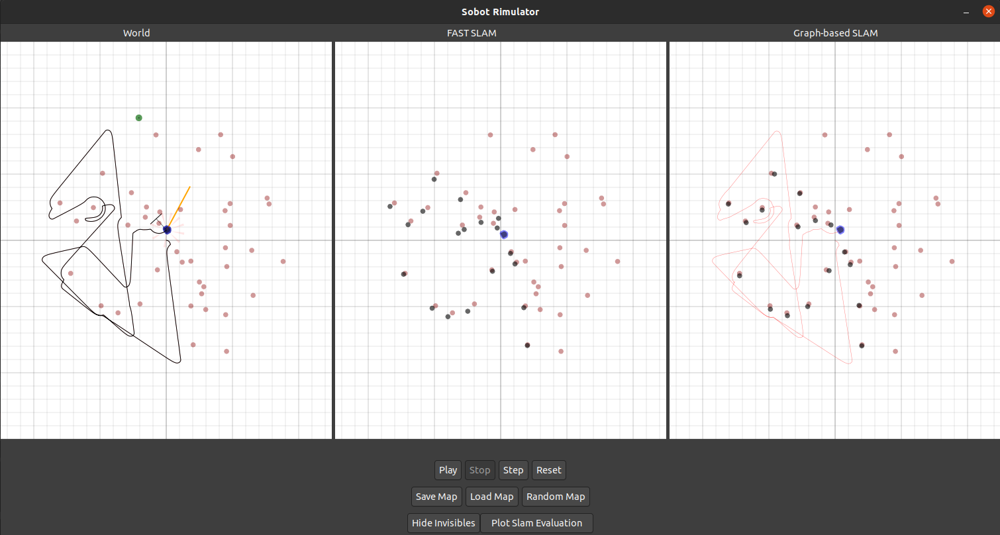

# Sobot Rimulator - A Robot Programming Tool

This project is an extension of the [sobot rimulator](https://github.com/nmccrea/sobot-rimulator) developed by Nick McCrea
which allows the simulation of a mobile robot in a map of obstacles that must be avoided.
This extension includes the integration of the EKFSLAM and FastSLAM algorithms to perform an estimation of the current robot state
and its surrounding environment based on its previous motion commands and proximity sensor readings.

## Requirements

*Sobot Rimulator* is cross-platform compatible. In order to run, the following must be installed on your computer:
- Python 3: Please follow the instructions at http://www.python.org/download/
- PyGTK 3: Please follow the instructions at https://pygobject.readthedocs.io/en/latest/getting_started.html
- NumPy: Please follow the instructions at https://scipy.org/install.html

Alternatively, this software is available through package managers such as Apt-Get (for Linux/Unix) or Homebrew (Recommended for Mac)

Additional required dependencies can be installed by
    
    pip3 install PyYAML
    

## To Run

Open a command prompt (terminal) and navigate to the *Sobot Rimulator* directory. Then type:

    python rimulator.py
    
This will start the simulator using the default `config.yaml` configuration file. A specific configuration file can be
specified as an additional program parameter:

    python rimulator.py original_config.yaml
    
## Graphical User Interface

The graphical user interface consists of the visualization of the current simulated world as well as a control panel of 
buttons with which the user can interact. The robot is depicted in blue and aims to reach its goal depicted in green 
while avoiding collisions with the red objects. The buttons of the control panel are:

#### Control row

- **Play**: Starts or continues the simulation
- **Stop**: Stops the simulation
- **Step**: Progresses the simulation by a single simulation cycle. If the simulation is running, it will first be stopped.
- **Reset** Reset the robot to its initial position 

#### Map row

- **Save map**: Opens a directory window, in which filename and path can be specified in order to save the current map.
 The default directory is [/maps](/maps), where multiple example maps are already stored.
- **Load map**: Opens a directory window, where a saved map can be selected to be loaded into the simulator.
- **Random map**: Generates a random map and resets the robot to the initial origin pose. Map generation parameters are 
specified in the configuration file.

#### Additional information row

- **Show/Hide invisibles**: The button lets the user toggle whether additional information shall be visualized. These 
include 
    - The true trajectory of the robot
    - The poximity sensors, where those detecting an obstacles are highlighted
    - The vector that the robot is currently headed towards
    - Additionally, the color of this vector displays the current control state of the robot
        - A green vector represents the `go to goal` state
        - An orange vector represents the `follow wall` state
        - A red vector represents the `avoid obstacles` state
    - The true obstacle positions for the SLAM frames
- **Plot covariance matrix**: This plots a visualization of the current covariance matrix of the EKF SLAM algorithm. 
Only displayed if the EKF SLAM is enabled in the configuration.
- **Plot Slam Evaluation**: Plots a graph for every enabled SLAM algorithm displaying the accuracy of its estimations 
over the course of the simulation. Only displayed if the SLAM evaluation is enabled in the configuration.

## Configuration

The simulator can be configured by a variety of paramters. The default configuration file is [config.yaml](config.yaml), 
where all parameters are documented. The configuration file [original_config.yaml](original_config.yaml) does not include
any of the extensions made and performs completely identical to the original sobot rimulator.

The most important parameters in terms of the SLAM algorithms are:

- `motion_noise`: Specifies the motion noise used by the algorithm, in my thesis denoted as `R_t`. The used motion 
noise is very low to reflect the very accurate motion of the simulated robot. Increasing the motion noise increases the 
region that the robot is estimated to be in.
- `sensor_noise`: Specifies the motion noise used by the algorithm, in my thesis denoted as `Q_t`. The used sensor noise
is relatively high, so the robot currently rarely makes large modifications of its pose estimate based on sensor readings.
- `distance_threshold`: Specifies a threshold to be used for the data association. Decreasing this value will increase 
the frequency of the SLAM algorithm considering a landmark as "new" instead of associating it with an encountered landmark.
- The evaluation `interval` specifies the interval of simulation cycles after which the SLAM accuracy shall be evaluated.
Low intervals can lead to performance problems. The SLAM evaluation can also be disabled entirely to further improve performance.

Other interesting parameters are

- the map configuration paramters, such as amount and shape of obstacles. It is however recommended to perform a SLAM simulation
with small, circular obstacles, which can be better represented by point-like landmarks.
- the robots control parameters, particularly the `caution_distance`. This parameter controls the robots transition into
the `follow wall` state and has been significantly decreased to avoid the problem of the robot looping around the small 
circular objects. Using large, rectangular objects allows the usage of a larger value.

The robot parameters are based on the *Khepera III* research robot and should **only be modified if you know what you are doing**, since some parameter values are not fully 
supported. Particularly **the amount of sensors and their placements are currently partially hard-coded** in the source code.

